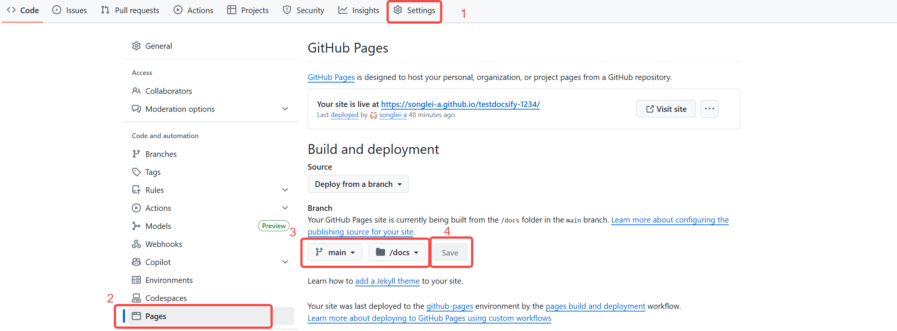

# 部署步骤
docsify文档网站参考教程，包括但不限于： 

<a href="https://blog.csdn.net/gradfly/article/details/122739628"  alt="教程-CSDN" target="_blank">教程-CSDN</a>

<a href="https://www.cnblogs.com/xhemj/p/How-to-Use-Docsify.html#%E5%AE%98%E6%96%B9%E8%AF%B4%E6%98%8E" alt="教程-博客" target="_blank">教程-博客</a>

<a href=" https://docsify.js.org/#/zh-cn/" alt="docsify官方文档" target="_blank">docsify官方文档</a>（有可能打不开）

## 1. 部署前提
- 已安装Node.js环境 
- 已安装Git环境   
- 已有GitHub账号 
- 本地已搭建并配置好docsify（方法详见上方教程），确保本地 docsify文档网站能正常运行。
- 创建GitHub**公开**仓库，存放docsify项目文件夹（ 本文新建仓库名称为testdocsify-1234，不与账号内其他仓库命名冲突即可）
## 2. 部署步骤
+ 本地docsify文件夹结构为：
```plaintext
 docs/ 
	├─ index.html 
	└─ README.md
```
+ 更改docs/index.html文件内容：
```HTML
<body>
  <div id="app"></div>
  <script>
    const isLocal = window.location.hostname === 'localhost';   // 判断是否是本地环境
    window.$docsify = {
      name: '文档网站命名',
      basePath: isLocal ? '' : '/你的仓库名/',    // 判断当前环境，动态设置basepath，让文档在不同的环境中都能正确加载和显示
      ......
      ......
     };
  </script>
</body>
```

+ 克隆GitHub仓库testdocsify-1234到本地；
  
+ 将docs文件夹整个复制到testdocsify-1234文件夹下,更改提交到仓库；
  
+ 并在GitHub仓库设置中点击Pages，选择主分支main和docs文件夹，保存；

  

+ 等待几分钟，即可访问https://你的GitHub账号名.github.io/你的仓库名/ 访问部署好的docsify网站。

+ 后期修改文件内容后，直接提交到GitHub仓库，GitHub会自动更新网站内容。
